1. Заходим на [сайт документации commercetools](https://docs.commercetools.com/sdk/postman)
2. нажимаем внизу на - [Composable Commerce collection](https://github.com/commercetools/commercetools-postman-collection/tree/master/api)
   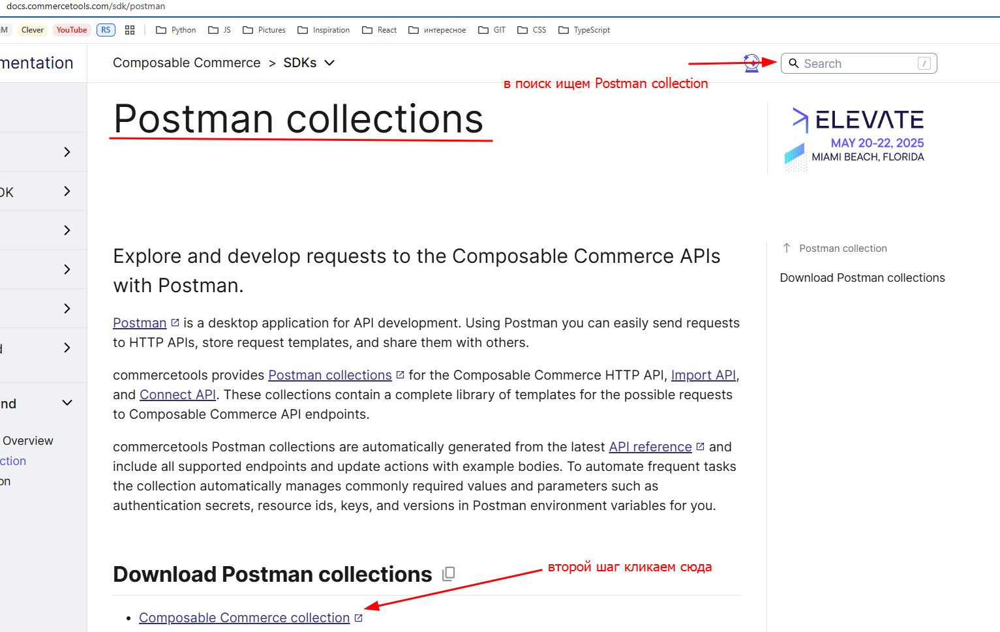
3. Открываем collection json
   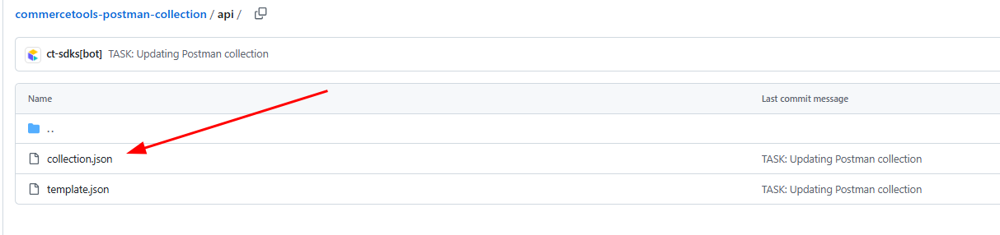
4. Жмем [View raw](https://github.com/commercetools/commercetools-postman-collection/raw/refs/heads/master/api/collection.json)
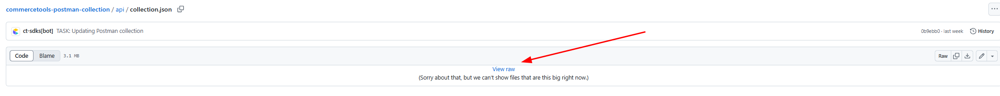
5. Копируем из адресной строки ссылку  [ссылка](https://raw.githubusercontent.com/commercetools/commercetools-postman-collection/refs/heads/master/api/collection.json)
6. идем в Postman и кликаем 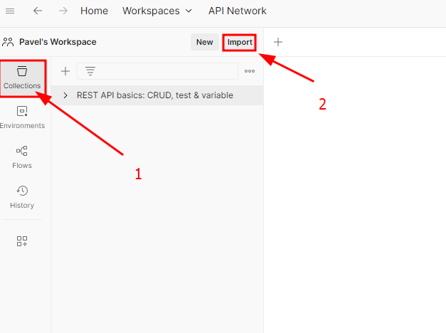
7. вставляем ссылку из 5 шага [ссылка](https://raw.githubusercontent.com/commercetools/commercetools-postman-collection/refs/heads/master/api/collection.json)  
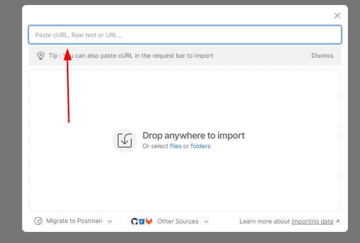
8.  Загружается коллекция наших запросов 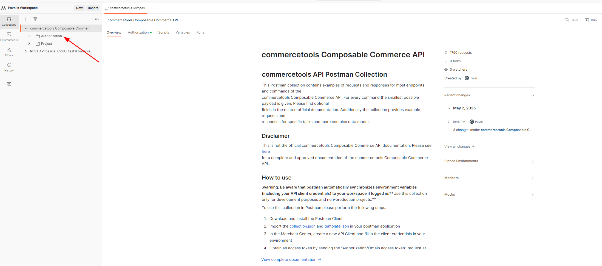
9. (Можете попробовать сами сделать или взять json объект перед 10 пунктом) Далее нам нужно получить наш Client API идем в наш выбираем настройки [commercetools](https://mc.europe-west1.gcp.commercetools.com/ecommerce_nlp/welcome)
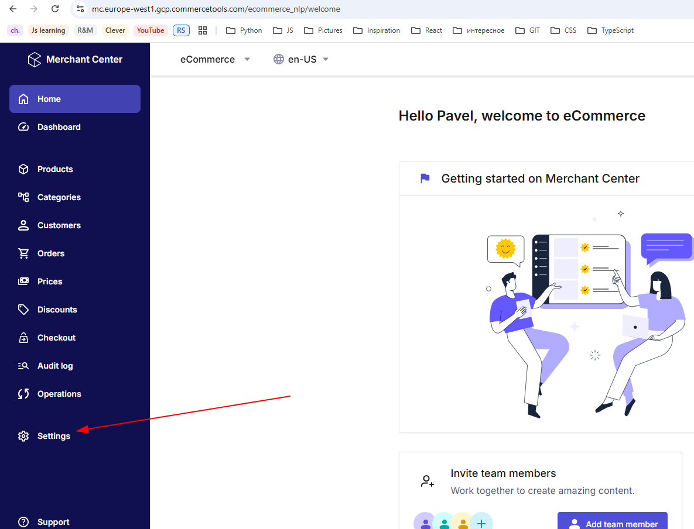
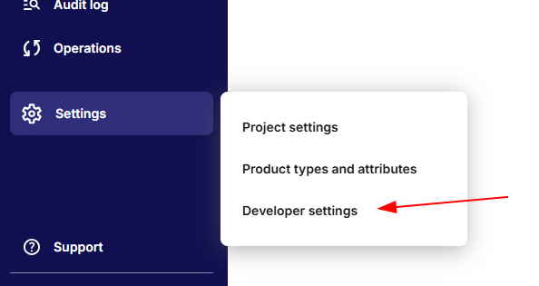
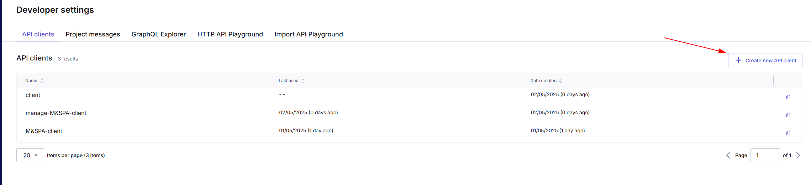
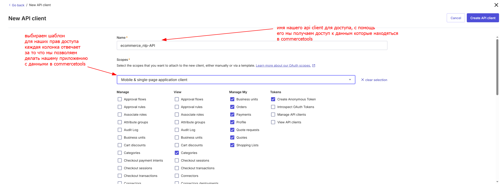
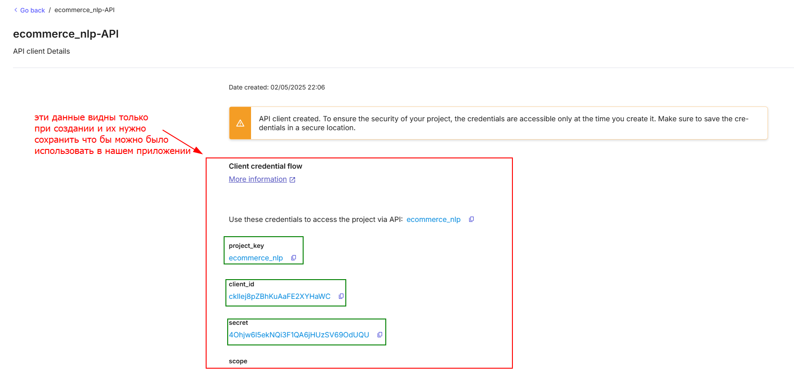
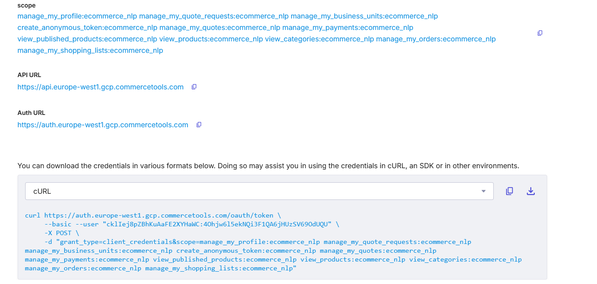
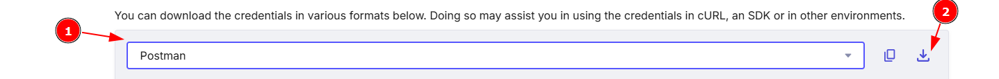
`  
{  
  "id": "a0faad43-5e03-41f7-a381-123f78139da1",  
  "name": "ecommerce_nlp",  
  "values": [  
    {  
      "key": "host",  
      "value": "https://api.europe-west1.gcp.commercetools.com",  
      "enabled": true,  
      "type": "text"  
    },  
    {  
      "key": "auth_url",  
      "value": "https://auth.europe-west1.gcp.commercetools.com",  
      "enabled": true,  
      "type": "text"  
    },  
    {  
      "key": "project-key",  
      "value": "ecommerce_nlp",  
      "enabled": true,  
      "type": "text"  
    },  
    {  
      "key": "client_id",  
      "value": "cklIej8pZBhKuAaFE2XYHaWC",  
      "enabled": true,  
      "type": "text"  
    },  
    {  
      "key": "client_secret",  
      "value": "4Ohjw6l5ekNQi3F1QA6jHUzSV69OdUQU",  
      "enabled": true,  
      "type": "text"  
    }  
  ],  
  "_postman_variable_scope": "environment",  
  "_postman_exported_at": "2025-05-02T19:12:23.774Z",  
  "_postman_exported_using": "Postman/6.0.10"  
}`
10. Скачивается json и мы копируем(объект выше)  или наш скачанный файл с нашим доступом и выполняем два шага  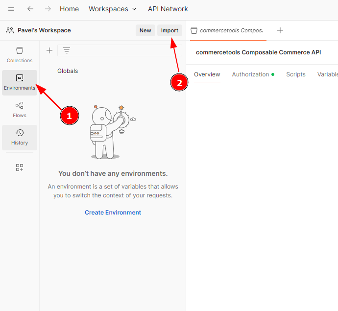
11. появляются наши данные доступа 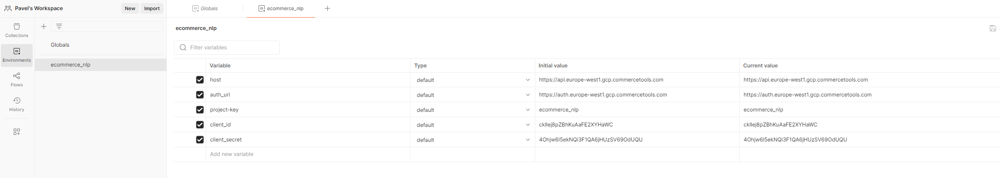
12. 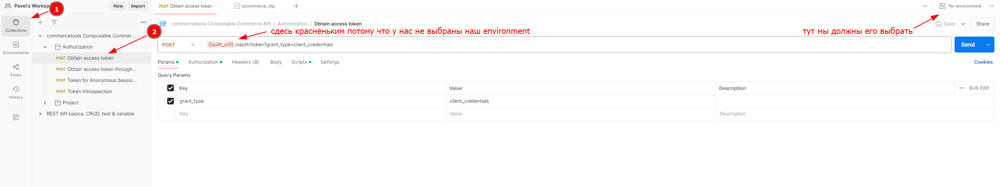
13. 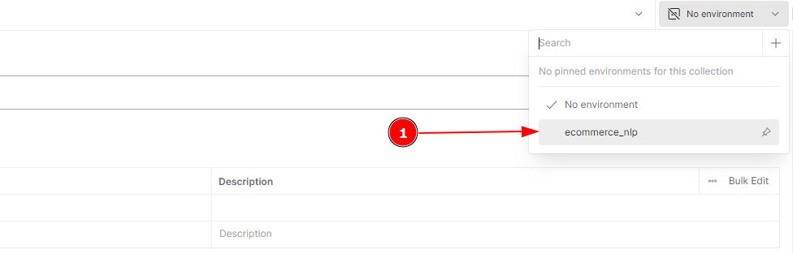
14. выбираем и можем отправлять запрос на получение access token
